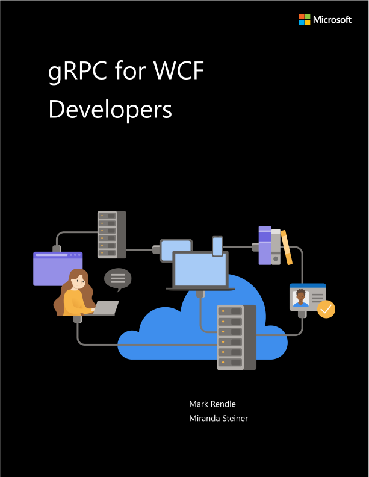

# ASP.NET Core gRPC for WCF Developers

PUBLISHED BY

Microsoft Developer Division, .NET, and Visual Studio product teams

A division of Microsoft Corporation

One Microsoft Way

Redmond, Washington 98052-6399

Copyright © 2019 by Microsoft Corporation

All rights reserved. No part of the contents of this book may be reproduced or transmitted in any form or by any means without the written permission of the publisher.

This book is provided “as-is” and expresses the author’s views and opinions. The views, opinions and information expressed in this book, including URL and other Internet website references, may change without notice.

Some examples depicted herein are provided for illustration only and are fictitious. No real association or connection is intended or should be inferred.

Microsoft and the trademarks listed at https://www.microsoft.com on the “Trademarks” webpage are trademarks of the Microsoft group of companies.

The Docker whale logo is a registered trademark of Docker, Inc. Used by permission.

All other marks and logos are property of their respective owners.

Authors:

> **Mark Rendle** - Chief Technical Officer - [Visual Recode](https://visualrecode.com)
>
> **Miranda Steiner** - Technical Author

Editor:

> **Maira Wenzel** - Sr. Content Developer - Microsoft

## Introduction

gRPC is a modern framework for building networked services and distributed applications. Imagine the performance of Windows Communication Foundation (WCF) NetTCP bindings, combined with the cross-platform interoperability of SOAP. gRPC builds on HTTP/2 and the Protobuf message-encoding protocol to provide high performance, low-bandwidth communication between applications and services. It supports server and client code generation across most popular programming languages and platforms, including .NET, Java, Python, Node.js, Go, and C++. With the first-class support for gRPC in ASP.NET Core 3.0, alongside the existing gRPC tools and libraries for .NET 4.x, it's an excellent alternative to WCF for development teams looking to adopt .NET Core in their organizations.

## Who should use this guide

This guide was written for developers working in .NET Framework or .NET Core who have previously used WCF, and who are seeking to migrate their applications to a modern RPC environment for .NET Core 3.0 and later versions. More generally, if you are upgrading, or considering upgrading, to .NET Core 3.0, and you want to use the built-in gRPC tools, this guide is also useful.

## How you can use this guide

This is a short introduction to building gRPC Services in ASP.NET Core 3.0, with particular reference to WCF as an analogous platform. It explains the principles of gRPC, relating each concept to the equivalent features of WCF, and offers guidance for migrating an existing WCF application to gRPC. It's also useful for developers who have experience with WCF and are looking to learn gRPC to build new services. You can use the sample applications as a template or reference for your own projects, and you are free to copy and reuse code from the book or its samples.

Feel free to forward this guide to your team to help ensure a common understanding of these considerations and opportunities. Having everybody working from a common set of terms and underlying principles helps ensure consistent application of architectural patterns and practices.

## References

- [gRPC website](https://grpc.io)
- [Choosing between .NET Core and .NET Framework for server apps](https://docs.microsoft.com/dotnet/standard/choosing-core-framework-server)

>[!div class="step-by-step"]
>[Next](introduction.md)
