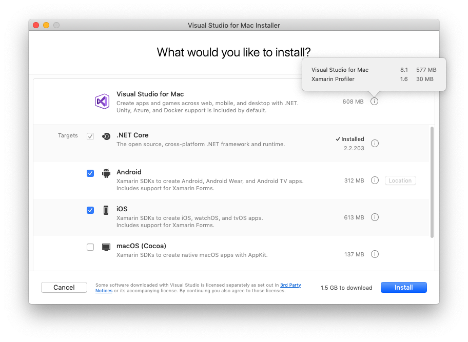

# Install the .NET Core SDK

In this article, you'll learn how to download and install the .NET Core SDK. The .NET Core SDK is used to create .NET Core apps and libraries. The .NET Core runtime is always installed with the SDK.

You can download and install .NET Core directly with one of the following links:

- [.NET Core 3.0 downloads](https://dotnet.microsoft.com/download/dotnet-core/3.0).
- [.NET Core 2.2 downloads](https://dotnet.microsoft.com/download/dotnet-core/2.2).
- [.NET Core 2.1 downloads](https://dotnet.microsoft.com/download/dotnet-core/2.1).

You can also install .NET Core as part of an integrated development environment (IDE), detailed in the sections below.

## Install with an installer

Both Windows and macOS have standalone installers that can be used to install the .NET Core SDK.

- Windows [x64 CPUs](https://dotnet.microsoft.com/download/thank-you/dotnet-sdk-3.0.100-windows-x64-installer) | [x32 CPUs](https://dotnet.microsoft.com/download/thank-you/dotnet-sdk-3.0.100-windows-x86-installer)
- macOS [x64 CPUs](https://dotnet.microsoft.com/download/thank-you/dotnet-sdk-3.0.100-macos-x64-installer)

::: zone pivot="os-linux"

## Install with a package manager

You can install .NET Core with many of the common linux package managers. For more information, see [Linux Package Manager - Install .NET Core](linux-package-manager-rhel7.md).

::: zone-end

::: zone pivot="os-windows"

## Visual Studio

If you're using Visual Studio to develop .NET Core apps, the following table describes the minimum required version of Visual Studio based on the target .NET Core runtime.

| .NET Core SDK version | Visual Studio version                      |
| --------------------- | ------------------------------------------ |
| 3.0                   | Visual Studio 2019 version 16.3 or higher. |
| 2.2                   | Visual Studio 2017 version 15.9 or higher. |
| 2.1                   | Visual Studio 2017 version 15.7 or higher. |

If you already have Visual Studio installed, you can check your version with the following steps.

01. Open Visual Studio.
01. Select the **Help** menu > **About Microsoft Visual Studio**.
01. Read the version number from the **About** dialog.

### Download

Visual Studio installs the latest .NET Core SDK and runtime, so you can target your app to run on the .NET Core runtime version of your choice.

- [Download Visual Studio](https://www.visualstudio.com/downloads/?utm_medium=microsoft&utm_source=docs.microsoft.com&utm_campaign=button+cta&utm_content=download+vs2019).

Selecting any of the managed workloads for **Web**, **Desktop**, or **Azure development**, will install the .NET Core SDK development tools and runtime. Specifically choosing the **.NET Core** workload also installs .NET Core.

[](media/install-sdk/windows-install-visual-studio-2019.png#lightbox)

::: zone-end

::: zone pivot="os-macos"

## Install with Visual Studio for Mac

Visual Studio for Mac installs the .NET Core SDK when the **.NET Core workload** is selected. To get started with .NET Core development on macOS, see [Install Visual Studio 2019 for Mac](/visualstudio/mac/installation).

[](media/install-sdk/mac-install-selection.png#lightbox)

::: zone-end

## Install with Visual Studio Code

Visual Studio Code is a powerful and lightweight source code editor that runs on your desktop. VS Code is available for Windows, macOS, and Linux.

While VS Code doesn't come with .NET Core support, adding .NET Core support is simple.

01. [Download and install Visual Studio Code](https://code.visualstudio.com/Download).
01. [Download and install the .NET Core SDK](https://dotnet.microsoft.com/download/dotnet-core/3.0).
01. [Install the C# extension from the VS Code marketplace](https://marketplace.visualstudio.com/items?itemName=ms-vscode.csharp).

::: zone pivot="os-windows"

## Install with PowerShell automation

The [dotnet-install scripts](../tools/dotnet-install-script.md) are used for automation and non-admin installs of the SDK. You can download the script from the [dotnet-install script reference page](../tools/dotnet-install-script.md).

The script defaults to installing the latest [long term support (LTS)](https://dotnet.microsoft.com/platform/support/policy/dotnet-core) version, which is currently .NET Core 2.1. To install the current release of .NET Core (3.0), run the script with the following switch:

```powershell
dotnet-install.ps1 -Channel 3.0
```

::: zone-end

::: zone pivot="os-linux,os-macos"

## Install with bash automation

The [dotnet-install scripts](../tools/dotnet-install-script.md) are used for automation and non-admin installs of the SDK. You can download the script from the [dotnet-install script reference page](../tools/dotnet-install-script.md).

The script defaults to installing the latest [long term support (LTS)](https://dotnet.microsoft.com/platform/support/policy/dotnet-core) version, which is currently .NET Core 2.1. To install the current release of .NET Core (3.0), run the script with the following switch:

```bash
./dotnet-install.sh -c Current
```

::: zone-end

## Docker

Containers provide a lightweight way to isolate your application from the rest of the host system, sharing just the kernel, and using resources given to your application.

.NET Core can run in a Docker container. Official .NET Core Docker images are published to the Microsoft Container Registry (MCR) and are discoverable at the [Microsoft .NET Core Docker Hub repository](https://hub.docker.com/_/microsoft-dotnet-core/). Each repository contains images for different combinations of the .NET (SDK or Runtime) and OS that you can use.

Microsoft provides images that are tailored for specific scenarios. For example, the [ASP.NET Core repository](https://hub.docker.com/_/microsoft-dotnet-core-aspnet/) provides images that are built for running ASP.NET Core apps in production.

For more information about using .NET Core in a Docker container, see [Introduction to .NET and Docker](../docker/introduction.md) and [Samples](https://github.com/dotnet/dotnet-docker/blob/master/samples/README.md).

## Next steps

::: zone pivot="os-windows"

- [C# Hello World tutorial](../tutorials/with-visual-studio.md).
- [Visual Basic Hello World tutorial](../tutorials/vb-with-visual-studio.md).

::: zone-end

::: zone pivot="os-macos"

- [Get started on macOS](../tutorials/using-on-mac-vs.md).

::: zone-end

- [Create a new app with Visual Studio Code](https://code.visualstudio.com/docs/languages/dotnet) tutorial.
- [Tutorial: Containerize a .NET Core app](../docker/build-container.md)
